# 实验报告五（web服务器）

## 实验环境：
- ubuntu18.04
- Wordpress4.7
- nginx
- VeryNginx
- DVWA

## 实验过程

###安装nginx
- 安装nginx
```
sudo apt install nginx
```
- 启动nginx
```
sudo systemctl start nginx
```


### 安装配置verynginx
#### 安装verynginx
> 安装准备：
>> sudo apt-get install libpcre3 libpcre3-dev;libssl-dev;gcc;make;zlib1g-dev;unzip;python3

> 克隆verynginx仓库到本地
> - sudo git clone https://github.com/alexazhou/VeryNginx.git

> 安装verynginx
> - cd VeryNginx
> - sudo python install.py install

> 配置verynginx
> - sudo vim /opt/verynginx/openresty/nginx/conf/nginx.conf
>> - user www-data
>> - server {listen 192.168.56.102:80
> - sudo -u
> - /opt/verynginx/openresty/nginx/sbin/nginx

### 安装wprdpress4.7
- 安装mysql
```sudo apt install mysql-server```
- 免密进入MySQL
```mysql -u root -p```
- 创建数据库
```CREATE DATABASE wordpress DEFAULT CHARACTER SET utf8 COLLATE utf8_unicode_ci;```
- 设置密码
```GRANT ALL ON wordpress.* TO 'wordpressuser'@'localhost' IDENTIFIED BY 'password';```
- 刷新
```FLUSH PRIVILEGES;```
- 退出
``` exit```
- 安装PHP
```sudo apt install php7.2-fpm php7.2-mysql php7.2-gd```
- 下载wordpress
```sudo wget https://wordpress.org/wordpress-4.7.zip```
- 解压
```unzip wordpress-4.7.zip```
- 解压后放入指定路径
```sudo cp -r wordpress /var/www/html/wp.sec.cuc.edu.cn(该路径：sudo mkdir /var/www/html/wp.sec.cuc.edu.cn)```
- 拷贝配置文件
```sudo cp wp-config-sample.php wp-config.php```
- 修改wp-config.php文件中的'datebase_name_here','username_here','password_here'以便能够访问mysql

### 安装PHP扩展
- ```sudo apt install php-curl php-gd php-intl  php-soap php-xml php-xmlrpc php-zip```
- 重启php-fpm
```sudo systemctl restart php7.2-fpm```
### 连接wordpress与nginx
```
# 新建配置文件，设置端口80和文件名wp.sec.cuc.edu.cn
WP_DOMAIN=wp.sec.cuc.edu.cn
WP_PORT=80
WP_PATH=/var/www/html/wp.sec.cuc.edu.cn
sudo tee /etc/nginx/sites-available/${WP_DOMAIN} << EOF
server {
    listen localhost:${WP_PORT};
    server_name ${WP_DOMAIN};
    root ${WP_PATH}/public;
    index index.php;
    location / {
        try_files \$uri \$uri/ /index.php?\$args;
    }
    location ~ \.php\$ {
        include snippets/fastcgi-php.conf;
        fastcgi_pass unix:/run/php/php7.2-fpm.sock;
    }
}
```
- 在sites-enabled中创建sites-available的软链接
```sudo ln -s /etc/nginx/sites-available/wp-domain/etc/nginx/sites-enabled/```
- 启动nginx
```sudo nginx```

### 修改nginx配置
- ```sudo vim /etc/nginx/sites-enabled/default```
- ```root /var/www/html/wp.sec.cuc.edu.cn```

### 安装配置DVWA
- 下载dvwa
```sudo git clone https://github.com/ethicalhack3r/DVWA```
- 移动至/tmp文件夹 
```mv DVWA /tmp/DVWA```
- 创建DVWA数据库
```CREATE DATABASE dvwa DEFAULT CHARACTER SET utf8 COLLATE utf8_unicode_ci;```
- ```GRANT ALL ON dvwa.* TO 'dvwauser'@'localhost' IDENTIFIED BY 'password2';```
- ```FLUSH PRIVILEGES;```
- ```exit```
- 重启mysql```sudo systemctl restart mysql```

### 拷贝config.inc.php.dist
```sudo cp /var/www/html/DVWA/config/config.inc.php.dist /var/www/html/DVWA/config/config.inc.php```

### 打开DVWA的配置文件并修改
```sudo vim /var/www/html/DVWA/config/config.inc.php```
> 设置以下项目
- allow_url_include = on
- allow_url_fopen = on
- safe_mode = off
- magic_quotes_gpc = off
- display_errors = off

#### 重启php-fpm使配置生效
```udo systemctl restart php7.2-fpm```

#### 设置DVWA文件夹访问权限
```sudo chown -R www-data.www-data /var/www/html/DVWA```


####配置文件
```
# 配置文件,8000端口
DVWA_DOMAIN=dvwa.sec.cuc.edu.cn
  DVWA_PORT=8000
  sudo tee /etc/nginx/sites-available/${DVWA_DOMAIN} << EOF
  server {
      listen localhost:${DVWA_PORT};
      server_name ${DVWA_DOMAIN};
      root /var/www/html/DVWA;
      index index.php;
     location / {
          try_files \$uri \$uri/ /index.php?\$args;
      }
      location ~ \.php\$ {
          include snippets/fastcgi-php.conf;
          fastcgi_pass unix:/run/php/php7.2-fpm.sock;
      }
  }
  EOF
```

 #### 设置软链接
```sudo ln -s /etc/nginx/sites-available/${DVWA_DOMAIN} /etc/nginx/sites-enabled/```
#### 重新载入配置
```sudo nginx -s reload```


#### 修改主机hosts文件

### 实验要求：
- [x] 在一台主机（虚拟机）上同时配置Nginx和VeryNginx  
  VeryNginx作为本次实验的Web App的反向代理服务器和WAF  
  PHP-FPM进程的反向代理配置在nginx服务器上，VeryNginx服务器不直接配置Web站点服务  
 - [x] 使用Wordpress搭建的站点对外提供访问的地址为： http://wp.sec.cuc.edu.cn  
 - [x] 使用Damn Vulnerable Web Application (DVWA)搭建的站点对外提供访问的地址为： http://dvwa.sec.cuc.edu.cn

### 安全加固
1.使用IP地址方式均无法访问上述任意站点，并向访客展示自定义的友好错误提示信息页面-1 
- 设置matcher
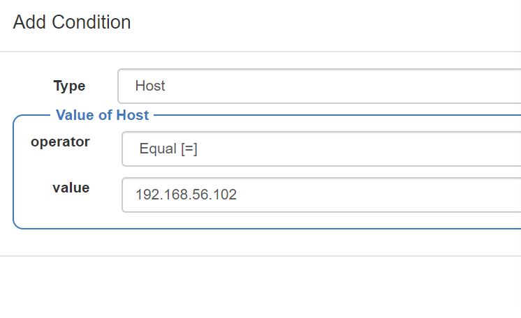

- 添加filter
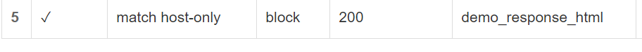

- 添加respense

2.DVWA只允许白名单上的访客来源IP，其他来源的IP访问均向访客展示自定义的友好错误提示信息页面-2(操作同1)

### 实验结果：
#### 上述实验的截图如下：
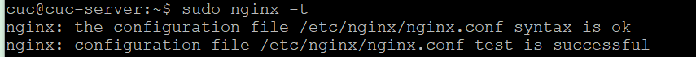
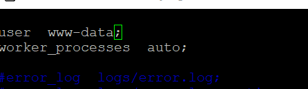
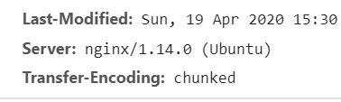
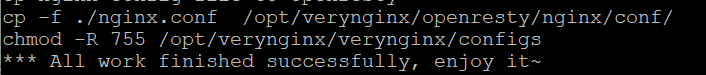
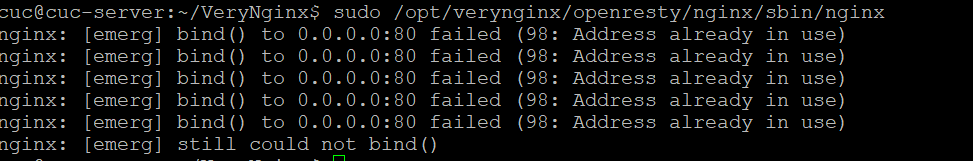
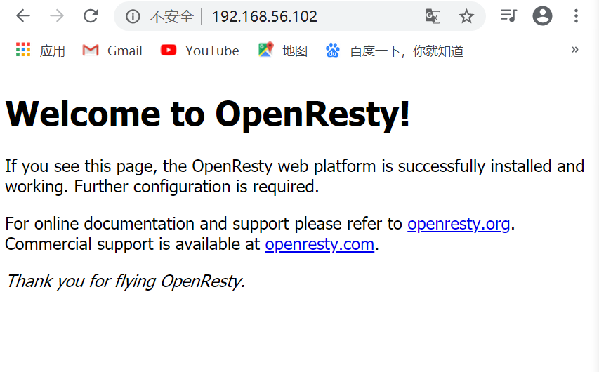
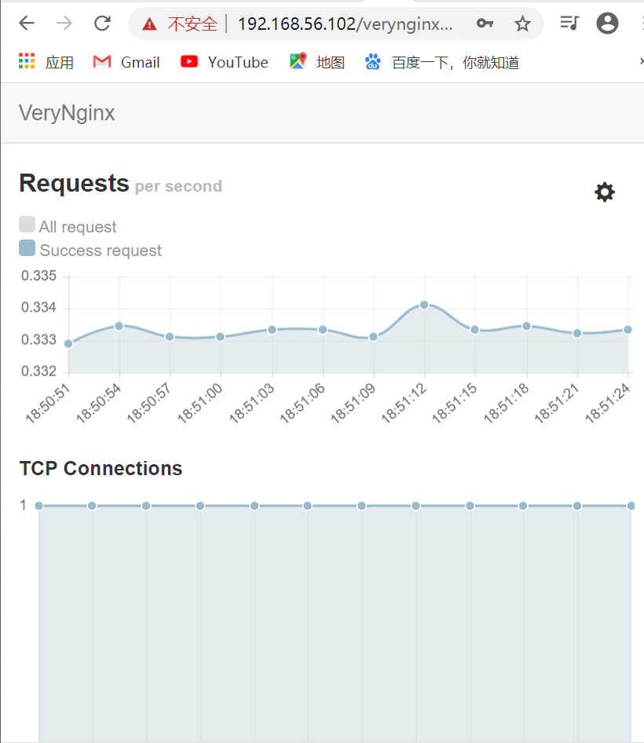
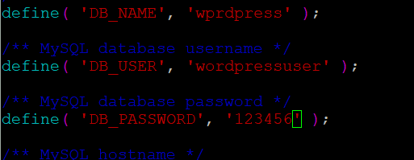
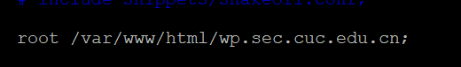
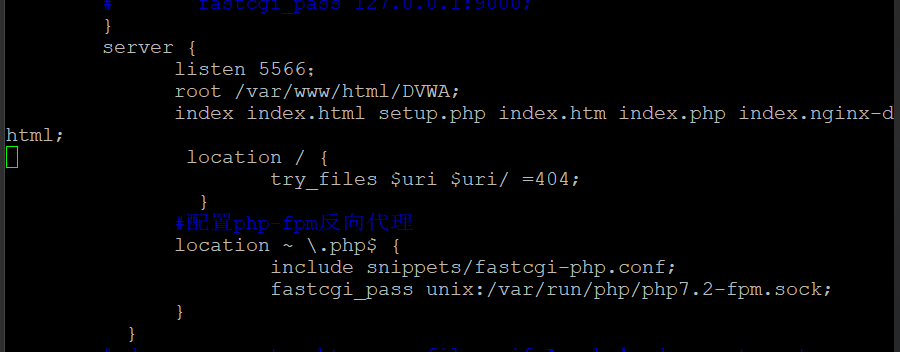
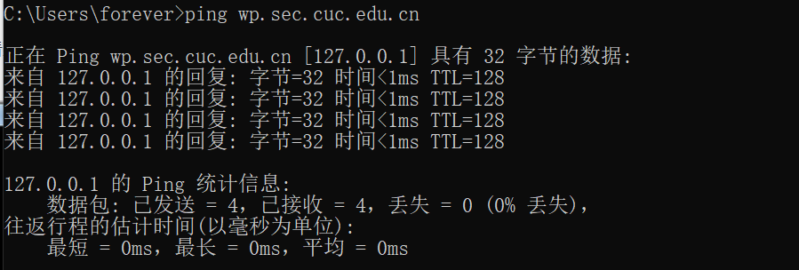
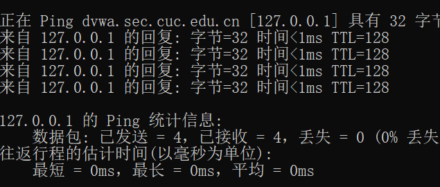
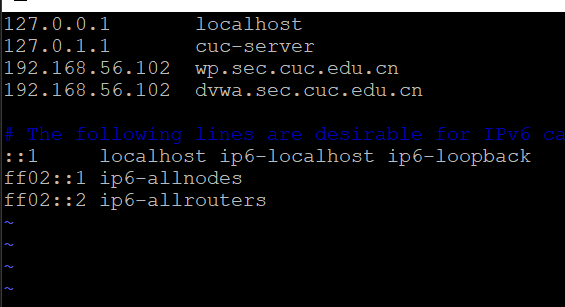
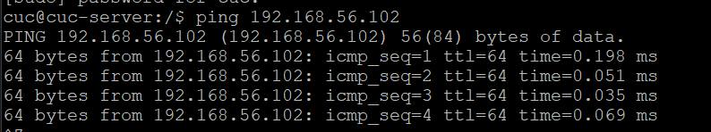
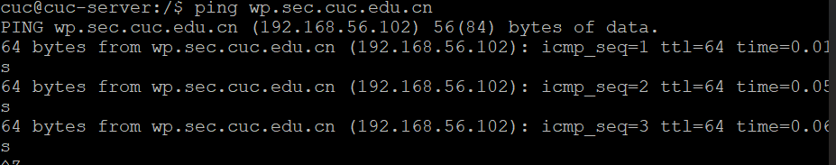

### 参考资料
- [install wordpress](https://www.digitalocean.com/community/tutorials/how-to-install-wordpress-with-lemp-on-ubuntu-18-04#step-1-%E2%80%94-creating-a-mysql-database-and-user-for-wordpress)
- [安装zlib](https://blog.csdn.net/wu_cai_/article/details/80278611)
- [参考作业](https://github.com/CUCCS/linux-2019-jackcily/pull/5/commits/f374d56e35a25f1660070bed86d0fcd60b352b68)
- [拷贝问题](https://blog.csdn.net/adley_app/article/details/81536962)
- [配置wordpress](https://www.cnblogs.com/yangjianbo/articles/9231847.html)

