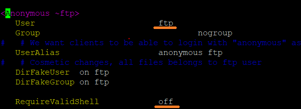
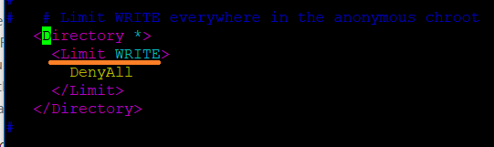
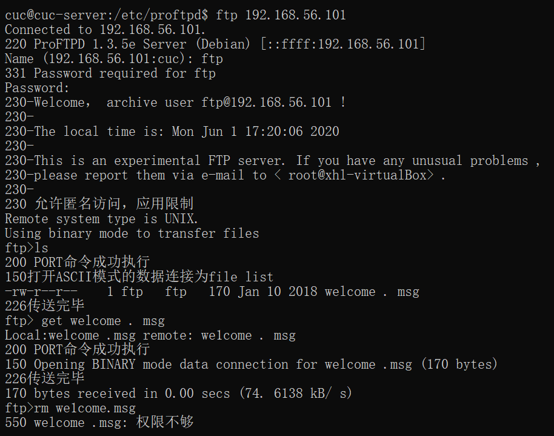
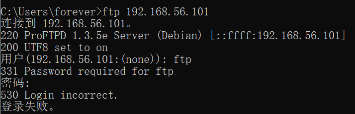
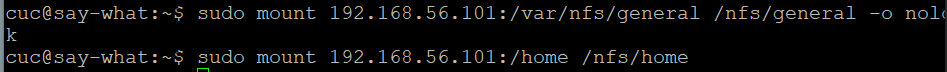
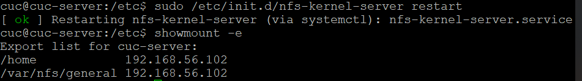
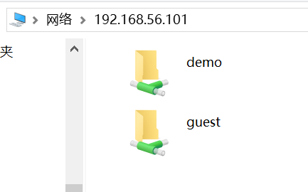
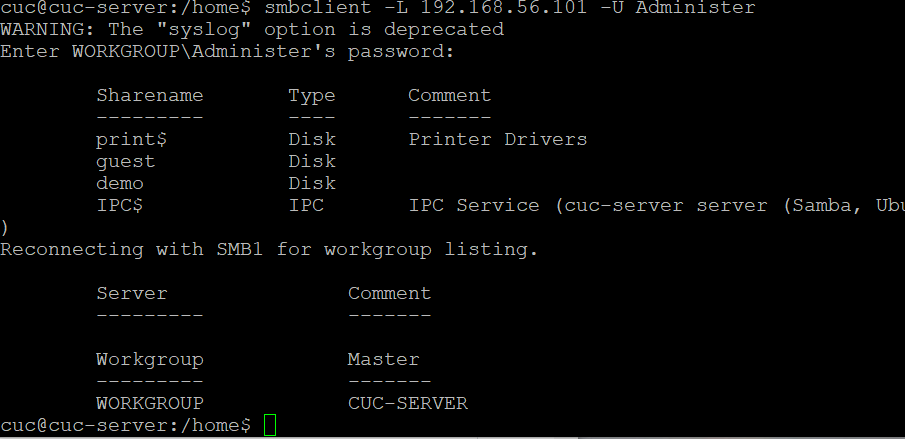

# Shell脚本编程进阶实验

## 实验环境
虚拟机A；192.168.56.101
虚拟机B：192.168.56.102
ubuntu18.04


## 实验过程

### 首先配置虚拟机A到虚拟机B的远程SSH root用户登录

- 在虚拟机A上生成秘钥对
  ssh-keygen -t rsa -P '' -f ~/.ssh/id_rsa
- 修改虚拟机B配置文件 允许root用户远程登录
  sudo vim /etc/ssh/sshd_config
  将PermitRootLogin 的值改为yes 并保存退出
- 执行ssh脚本将公钥从虚拟机A推送到虚拟机B(为确保配置文件有效 必须保证root用户密码正确 sudo passwd root 修改root用户密码)
  ssh-copy-id ~/.ssh/id_rsa.pub cuc@192.168.56.102
- 此时即可在虚拟机A上SSH cuc用户登陆到虚拟机B
  ssh cuc@192.168.56.102


### proftpd
- [x] 配置一个提供匿名访问的FTP服务器，匿名访问者可以访问1个目录且仅拥有该目录及其所有子目录的只读访问权限


- [x] 配置一个支持用户名和密码方式访问的账号，该账号继承匿名访问者所有权限，且拥有对另1个独立目录及其子目录完整读写（包括创建目录、修改文件、删除文件等）权限，（该账号仅可用于FTP服务访问，不能用于系统shell登录）
> - AuthOrder mod_auth_file.c mod_auth_unix.c
> - AuthUserFile /usr/local/etc/proftpd/passwd
> - AuthGroupFile /usr/local/etc/proftpd/group
> - PersistentPasswd off
> - RequireValidShell off

#### 使用ftppasswd 创建passwd和group文件

- 创建用户
spawn ftpasswd --passwd --file=/etc/proftpd/passwd --name=${FTP_USER} --uid=1024 --home=/home/${FTP_USER} --shell=/bin/false
- 创建组
ftpasswd --file=/etc/proftpd/group --group --name=virtualusers --gid=1024
- 将用户加入组
ftpasswd --group --name=virtualusers --gid=1024 --member=${FTP_USER} --file=/etc/proftpd/group

- [x] FTP用户不能越权访问指定目录之外的任意其他目录和文件
> 在proftpd.conf配置文件中，添加DefaultRoot ~ 限定用户只能访问自己的目录

- [x]匿名访问权限仅限白名单IP来源用户访问，禁止白名单IP以外的访问
- 修改proftpd.conf文件
```
<Limit LOGIN>
       Order allow,deny
       Allow from 192.168.56.101
       Deny from all
</Limit>
```

- [x] 对ftp配置的测试
- 对匿名FTP的测试

- 匿名ftp - 只允许白名单ip访问，其他用户访问会被拒绝。



### NFS
- [x] 在1台Linux上配置NFS服务，另1台电脑上配置NFS客户端挂载2个权限不同的共享目录，分别对应只读访问和读写访问权限.
- client和server的配置步骤
```bash
#client
ip:192.168.56.101
sudo apt install nfs-common

#server
ip:192.168.56.102
sudo apt install nfs-kernel-server

#创建一个用于挂载的可读写的文件夹
mkdir /var/nfs/general -p
chown nobody:nogroup /var/nfs/general
#另一个用于挂载的只读文件夹 /home （无需创建）

#配置文件 /etc/exports  指定clients ip和权限
/var/nfs/general    192.168.56.101(rw,sync,no_subtree_check)
/home       192.168.56.101(sync,no_root_squash,no_subtree_check)

#在Client上创建相应的挂载文件
sudo mkdir -p /nfs/general
sudo mkdir -p /nfs/home

#在Client上挂载文件夹
sudo mount 192.168.56.102:/var/nfs/general /nfs/general
sudo mount 192.168.56.102:/home /nfs/home
```



- 共享目录中文件、子目录的属主、权限信息和在NFS服务器端上查看到的信息一样吗？无论是否一致，请给出你查到的资料是如何讲解NFS目录中的属主和属主组信息应该如何正确解读
```
在/etc/exports配合文件中设置共享文件夹属性时，会涉及到一个参数no_root_squash，如果不设置这个参数，即使在客户端使用sudo创建目录文件，属主和权限信息都继承父文件夹，并不是root:root；相反，如果设置该参数，以sudo创建的目录文件就会是root:root。
```
- 配置完毕，可以重启NFS服务
> sudo /etc/init.d/nfs-kernel-server restart
       
- 查看NFS目录可以使用  ```showmount -e``` 命令

### Samba
#### 修改配置文件smb.conf,guest 设置匿名共享目录，目录demo使用用户名密码可以进行读写。
```bash
[guest]
        # This share allows anonymous (guest) access
        # without authentication!
        path = /srv/samba/guest/
        read only = yes
        guest ok = yes

[demo]
        # This share requires authentication to access
        path = /srv/samba/demo/
        read only = no
        guest ok = no
        force create mode = 0660
        force directory mode = 2770
        force user = demoUser
        force group = demoGroup
```

- [x] Linux设置匿名访问共享目录/Linux设置用户名密码方式的共享目录
```bash 
#安装
sudo apt install samba
#创建用户
useradd -M -s /sbin/nologin ${SMB_USER}
sudo passwd smbuser

#在linux中添加同名用户
smbpasswd -a smbuser
#使设置的账户生效
smbpasswd -e smbuser
#创建用户组并加入
groupadd smbgroup
usermod -G smbgroup smbuser
#创建用于共享的文件夹并修改用户组
mkdir -p /home/samba/guest/
mkdir -p /home/samba/demo/
chgrp -R smbgroup /home/samba/guest/
chgrp -R smbgroup /home/samba/demo/
chmod 2775 /home/samba/guest/
chmod 2770 /home/samba/demo/
#启动Samba
smbd

#客户端为win10访问共享文件夹
\\192.168.56.101\guest
\\192.168.56.101\demo
```



- [x] 在windows指定目录设置为共享用户名密码方式共享目录
```bash
#在linux下载安装smbclient
sudo apt-get install smbclient
#查看所有共享目录（需要输入windows的用户名和密码 -u指定windows的登陆用户名 然后需要输入密码）
smbclient -L 192.168.56.101 -U Administer
#访问共享目录
smbclient  -U Administer //192.168.56.101/masm
```



- [x] 下载整个目录
```
首先从linux登陆到ubuntu的共享文件夹，需要输入密码
命令行输入 tarmode
命令行输入 recurse
命令行输入 prompt
命令行输入 mget 指定文件被下载到的目录\
```

### DHCP

- [x] 2台虚拟机使用Internal网络模式连接，其中一台虚拟机上配置DHCP服务，另一台服务器作为DHCP客户端，从该DHCP服务器获取网络地址配置
- 首先进行DHCP的安装和配置
```bash
#修改server的/etc/network/interfaces文件
auto enp0s9
iface enp0s9 inet static
address 192.168.254.25
netmask 255.255.255.0
gateway 192.168.254.25
#server端安装需要使用的软件
apt install isc-dhcp-server
#修改server中/etc/default/isc-dhcp-server文件  配置提供DHCP服务的网卡
INTERFACES="enp0s9"
#修改server中/etc/dhcp/dhcpd.conf文件  添加如下配置如下
subnet 10.0.2.0 netmask 255.255.255.0 {
  range dynamic-bootp 10.0.2.65 10.0.2.100;
  option broadcast-address 10.0.2.255;
  option subnet-mask 255.255.255.0;
  default-lease-time 600;
  max-lease-time 7200;
}
#server端开启 isc-dhcp-server 服务
service isc-dhcp-server restart
```

- 在另一台ubuntu服务器中配置开启内部网卡的dhcp服务，配置完成后，查看dhcp的结果
```
sudo vim /etc/netplan/01-netcfg.yaml
#最终配置结果如下
network:
  version: 2
  renderer: networkd
  ethernets:
    enp0s3:
      dhcp4: yes

network:
        ethernets:
                enp0s8:
                        addresses: [169.254.134.150/16]
                        dhcp4: no
                        optional: true
                enp0s9:
                        dhcp4: yes
#使配置生效
sudo netplan apply 
```

### DNS
- 安装bind9 、配置bind9
```bash
#打开 /etc/bind/named.conf.local 添加以下内容
zone "cuc.edu.cn" {
    type master;
    file "/etc/bind/db.cuc.edu.cn"
};  

#创建保存域名解析的db文件
sudo cp /etc/bind/db.local /etc/bind/db.cuc.edu.cn


#编辑/etc/bind/db.cuc.edu.cn文件 添加需要解析的域名
wp.sec.cuc.edu.cn       IN      A       10.0.2.15
dvwa.sec.cuc.edu.cn     IN      CNAME   wp.sec.cuc.edu.cn.
test.com                IN      A       10.0.2.65

#重启服务
service bind9 restart
```

- 客户端配置使用对应的服务器
```
#客户端添加解析服务器
sudo vim /etc/resolvconf/resolv.conf.d/head
	search cuc.edu.cn
	nameserver 192.168.56.101

#更新resolv.conf文件
sudo apt install resolvconf
sudo resolvconf -u
```

- DNS实验要求
- [x]基于上述Internal网络模式连接的虚拟机实验环境，在DHCP服务器上配置DNS服务，使得另一台作为DNS客户端的主机可以通过该DNS服务器进行DNS查询
- [x]在DNS服务器上添加 zone "cuc.edu.cn" 的以下解析记录


### 实验参考
  - [配置proftpd](https://www.cnblogs.com/clnchanpin/p/6850111.html)
  - [nfs](https://www.cnblogs.com/xingbaohao/p/5237386.html)
  - [参考1](https://github.com/CUCCS/linux/blob/master/2017-1/TJY/%E7%BD%91%E7%BB%9C%E8%B5%84%E6%BA%90%E5%85%B1%E4%BA%AB/%E7%BD%91%E7%BB%9C%E8%B5%84%E6%BA%90%E5%85%B1%E4%BA%AB.md)
  - [参考2](https://github.com/CUCCS/linux-2019-jackcily/blob/job6/job6/job6.md)
  - [参考3](https://c4pr1c3.github.io/LinuxSysAdmin/chap0x06.md.html)