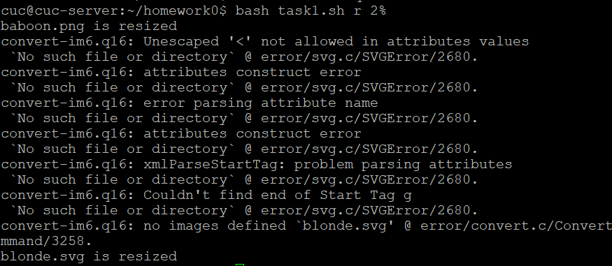
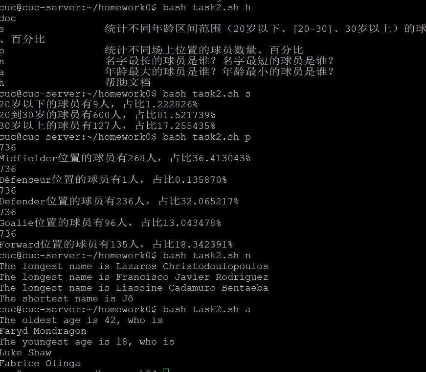
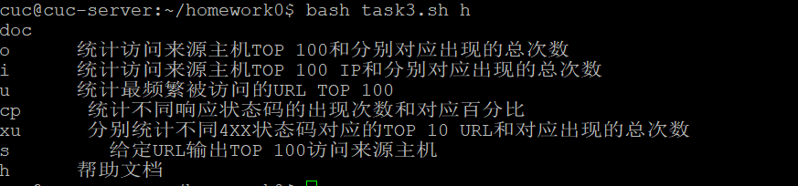
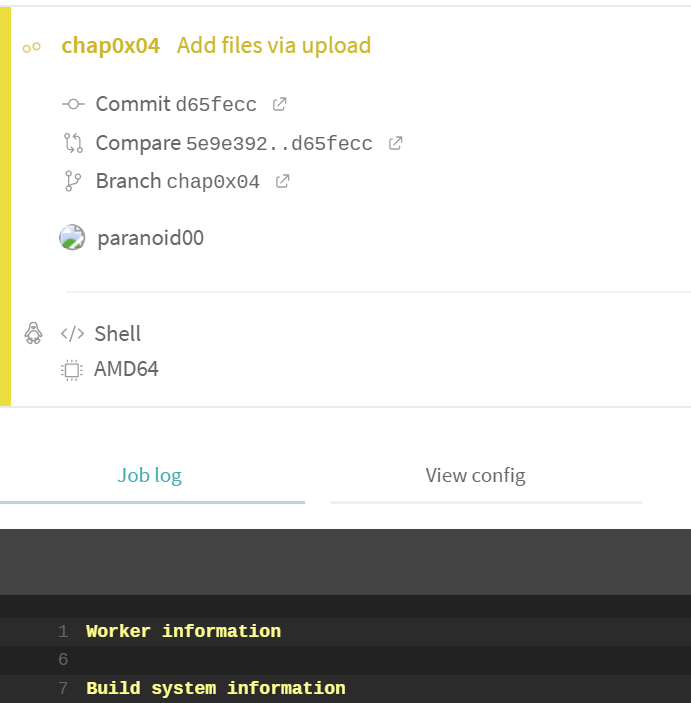

# 实验4实验报告
## 实验要求：
- 所有源代码文件必须单独提交并提供详细的脚本内置帮助信息
- 任务二的所有统计数据结果要求写入独立实验报告

## 实验环境：
- 系统环境：ubuntu18.04
- 安装ImageMagick工具：sudo apt install imagemagick

## 实验过程
### 任务：

---

* 任务一：用bash编写一个图片批处理脚本，实现以下功能：
    * 支持命令行参数方式使用不同功能
    * 支持对指定目录下所有支持格式的图片文件进行批处理
    * 支持以下常见图片批处理功能的单独使用或组合使用
        * 支持对jpeg格式图片进行图片质量压缩
        * 支持对jpeg/png/svg格式图片在保持原始宽高比的前提下压缩分辨率
        * 支持对图片批量添加自定义文本水印
        * 支持批量重命名（统一添加文件名前缀或后缀，不影响原始文件扩展名）
        * 支持将png/svg图片统一转换为jpg格式图片

---

* 任务二：用bash编写一个文本批处理脚本，对以下附件分别进行批量处理完成相应的数据统计任务：
    * [2014世界杯运动员数据](exp/chap0x04/worldcupplayerinfo.tsv)
        * 统计不同年龄区间范围（20岁以下、[20-30]、30岁以上）的球员**数量**、**百分比**
        * 统计不同场上位置的球员**数量**、**百分比**
        * 名字最长的球员是谁？名字最短的球员是谁？
        * 年龄最大的球员是谁？年龄最小的球员是谁？

---

* 任务二：用bash编写一个文本批处理脚本，对以下附件分别进行批量处理完成相应的数据统计任务：
    * [Web服务器访问日志](exp/chap0x04/web_log.tsv.7z)
        * 统计访问来源主机TOP 100和分别对应出现的总次数
        * 统计访问来源主机TOP 100 IP和分别对应出现的总次数
        * 统计最频繁被访问的URL TOP 100
        * 统计不同响应状态码的出现次数和对应百分比
        * 分别统计不同4XX状态码对应的TOP 10 URL和对应出现的总次数
        * 给定URL输出TOP 100访问来源主机

---
## 部分语法：
### convert
#### 对jpeg格式图片进行图片质量压缩
- convert filename1 -quality 50 filename2

#### 对jpeg/png/svg格式图片在保持原始宽高比的前提下压缩分辨率
- convert filename1 -resize 50% filename2

#### 对图片批量添加自定义文本水印
-  convert filename1 -pointsize 50 -fill black -gravity center -draw "text 10,10 'Works like magick' " filename2

#### 批量重命名（统一添加文件名前缀或后缀，不影响原始文件扩展名）
- mv filename1 filename2

#### 将png/svg图片统一转换为jpg格式图片
* convert xxx.png xxx.jpg

#### psftp批量导出和导入文件
* get -r /home/cuc/homework0/ D:/clone18-04/
* put -r D:/clone18-04/ /home/cuc/homework0/

## 实验部分结果：

---

---

---

---

---

---

## 参考：
[psftp用法](https://www.bbsmax.com/A/QV5ZvV4Z5y/)
[shell教程](https://www.runoob.com/linux/linux-shell.html)
[awk命令](https://www.runoob.com/linux/linux-comm-awk.html)
[convert用法](https://www.cnblogs.com/robben/p/4315123.html)
[参考实验报告](https://github.com/CUCCS/linux-2019-jckling/blob/master/0x04/%E5%AE%9E%E9%AA%8C%E6%8A%A5%E5%91%8A.md)
[参考实验报告](https://github.com/LyuLumos/linux-2020-LyuLumos/tree/ch0x04/ch0x04)